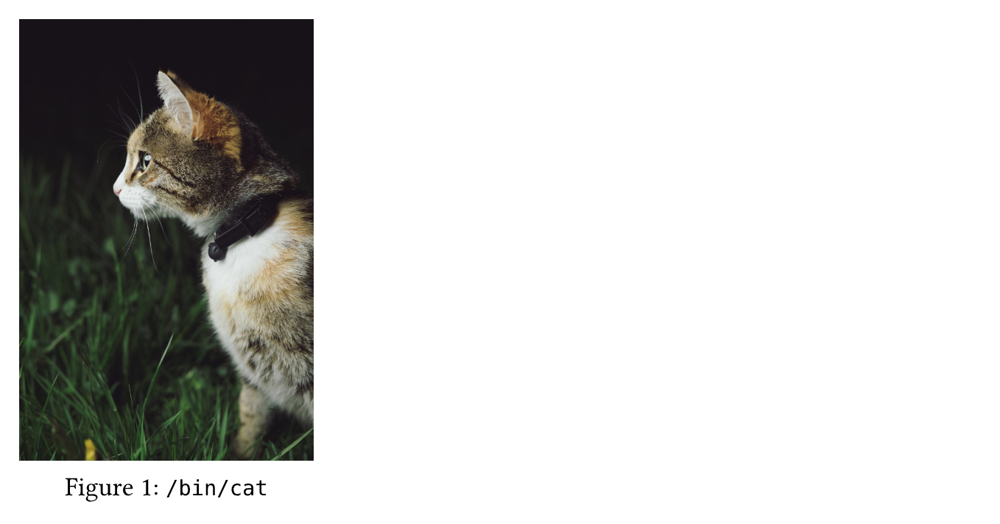
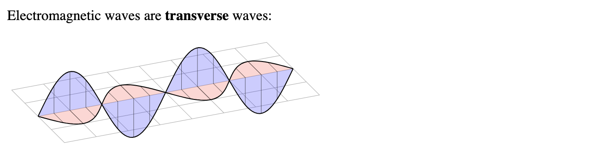

# markdown-it-typst

[![npm version][npm-version-src]][npm-version-href]
[![npm downloads][npm-downloads-src]][npm-downloads-href]
[![bundle][bundle-src]][bundle-href]
[![JSDocs][jsdocs-src]][jsdocs-href]
[![License][license-src]][license-href]

A simple [`typst.ts`](https://github.com/Myriad-Dreamin/typst.ts) wrapper that adds [Typst](https://github.com/typst/typst) support to [`markdown-it`](https://github.com/markdown-it/markdown-it).

**WARNING**: It's NOT recommended to run this plugin on browser side, as it is not optimized for tree-shaking. (See [`typst.ts` Documentation](https://myriad-dreamin.github.io/typst.ts/cookery/guide/all-in-one-node.html)) However, utilizing the browser-side version of `typst.ts` is still possible, any PRs regarding this are welcome.

---

## Usage

```bash
npm install markdown-it-typst
```

```ts
import MarkdownIt from "markdown-it";
import MarkdownItTypst from "./lib/index";

const md = new MarkdownIt().use(MarkdownItTypst);
const code = `
\`\`\`typst
#set text(font: "New Computer Modern")

Let $a$, $b$, and $c$ be the side
lengths of right-angled triangle.
Then, we know that:
$ a^2 + b^2 = c^2 $

Prove by induction:
$ sum_(k=1)^n k = (n(n+1)) / 2 $
\`\`\`
`;

const html = md.render(code);

console.log(html);

// Output:
//
// <div class="typst">
// <svg class="typst-doc" [...]>
// [...]
// </svg>
// </div>
```

The code above will render the following web page:


---

## Features

 - **Able to import packages**:

    ~~~md
    **Normal** *Markdown* code :-)

    ```typst
    #import "@preview/cetz:0.2.2": canvas, draw, tree
    #canvas(length: 2.5cm, {
        import draw: *
        tree.tree(
            draw-node: (node, ..) => {
                if node.content == [] { return none }
                circle((), radius: .35, stroke: black)
                content((), [#node.content])
            },
            draw-edge: (from, to, pa, child) => {
                if child.content == [] { return none }
                tree.default-draw-edge(from, to, pa, child)
            },
            ([15], ([13], [12], [14]), ([17], [16], ([18], [], [18])))
        )
    })
    ```
    ~~~

    

 - **Able to import external files**:

    ~~~md
    ```typst
    #figure(
        image("./images/cat.png", width: 200pt),
        caption: [`/bin/cat`],
    )
    ```
    ~~~

    

---

## Options

Default options:

```ts
const md = new MarkdownIt().use(MarkdownItTypst, {
    identifier: "typst",
    typstWrapper: (code: string) =>
        "#set page(width: auto, height: auto, margin: 5pt)\n" +
        "#set text(size: 18pt)\n" +
        code,
    svgWrapper: (svg: string) => '<div class="typst">\n' + svg + "\n</div>",
});
```

### `identifier`

 - Type: `string | string[]`
 - Default: `"typst"`

The language identifier(s) of the Typst code block. Only code blocks with the specified identifiers will be processed.

### `typstWrapper`

 - Type: `(code: string) => string`
 - Default: `(code: string) => "#set page(width: auto, height: auto, margin: 5pt)\n#set text(size: 18pt)\n" + code`

Typst code will be wrapped with this function before being compiled.

### `svgWrapper`

 - Type: `(svg: string) => string`
 - Default: `(svg: string) => '<div class="typst">\n' + svg + "\n</div>"`

The SVG output will be wrapped with this function during rendering.

---

## Examples

The probably most handy application is to render CeTZ graphs in Markdown:

```ts
const md = new MarkdownIt().use(MarkdownItTypst, {
    typstWrapper: (code: string) =>
        "#set page(width: auto, height: auto, margin: 5pt)\n" +
        '#import "@preview/cetz:0.2.2": canvas, draw, vector, matrix\n' +
        "#canvas(length: 1cm, {\n" +
        "    import draw: *\n" +
        code +
        "})",
    identifier: "cetz",
});
```

~~~md
Electromagnetic waves are **transverse** waves:

```cetz
// Code borrowed from CeTZ: https://typst.app/universe/package/cetz/

// Set up the transformation matrix
set-transform(matrix.transform-rotate-dir((1, 1, -1.3), (0, 1, .3)))
scale(x: 1.5, z: -1)

grid((0,-2), (8,2), stroke: gray + .5pt)

// Draw a sine wave on the xy plane
let wave(amplitude: 1, fill: none, phases: 2, scale: 8, samples: 100) = {
    line(..(for x in range(0, samples + 1) {
        let x = x / samples
        let p = (2 * phases * calc.pi) * x
        ((x * scale, calc.sin(p) * amplitude),)
    }), fill: fill)

    let subdivs = 8
    for phase in range(0, phases) {
        let x = phase / phases
        for div in range(1, subdivs + 1) {
            let p = 2 * calc.pi * (div / subdivs)
            let y = calc.sin(p) * amplitude
            let x = x * scale + div / subdivs * scale / phases
            line((x, 0), (x, y), stroke: rgb(0, 0, 0, 150) + .5pt)
        }
    }
}

group({
    rotate(x: 90deg)
    wave(amplitude: 1.6, fill: rgb(0, 0, 255, 50))
})
wave(amplitude: 1, fill: rgb(255, 0, 0, 50))
```
~~~



The option `typstWrapper` can serve as a way to inject the necessary imports and setup code for typst. However, it may appear ugly to have such long code in the wrapper function. A better way it to utilize the `#import` directive in the Typst code block:

```ts
const md = new MarkdownIt().use(MarkdownItTypst, {
    typstWrapper: (code: string) =>
        '#import("./preset.typ")\n' + code,
});
```

---

## License

[MIT](./LICENSE) License © 2024 [Xecades](https://github.com/xecades)

<!-- Badges from markdown-it-mdc -->

[npm-version-src]: https://img.shields.io/npm/v/markdown-it-typst?style=flat&colorA=080f12&colorB=1fa669
[npm-version-href]: https://npmjs.com/package/markdown-it-typst
[npm-downloads-src]: https://img.shields.io/npm/dm/markdown-it-typst?style=flat&colorA=080f12&colorB=1fa669
[npm-downloads-href]: https://npmjs.com/package/markdown-it-typst
[bundle-src]: https://img.shields.io/bundlephobia/minzip/markdown-it-typst?style=flat&colorA=080f12&colorB=1fa669&label=minzip
[bundle-href]: https://bundlephobia.com/result?p=markdown-it-typst
[license-src]: https://img.shields.io/github/license/xecades/markdown-it-typst.svg?style=flat&colorA=080f12&colorB=1fa669
[license-href]: https://github.com/xecades/markdown-it-typst/blob/main/LICENSE
[jsdocs-src]: https://img.shields.io/badge/jsdocs-reference-080f12?style=flat&colorA=080f12&colorB=1fa669
[jsdocs-href]: https://www.jsdocs.io/package/markdown-it-typst
